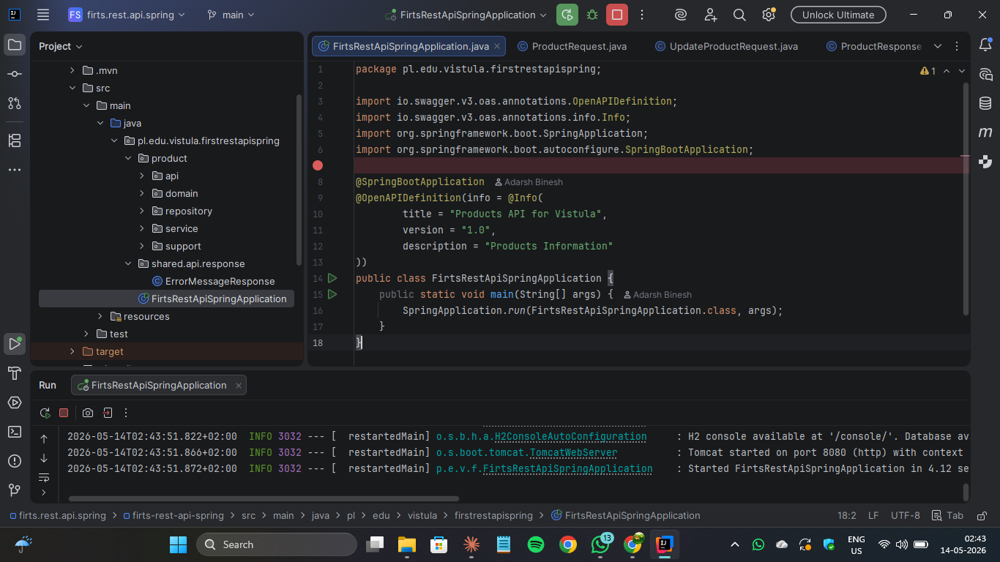
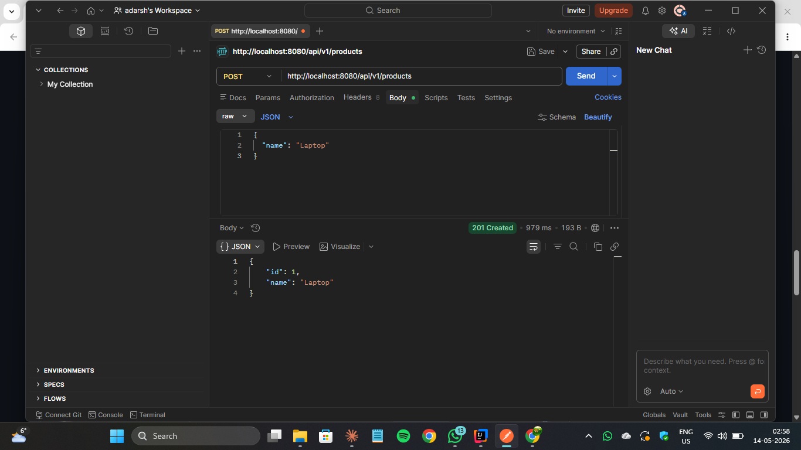
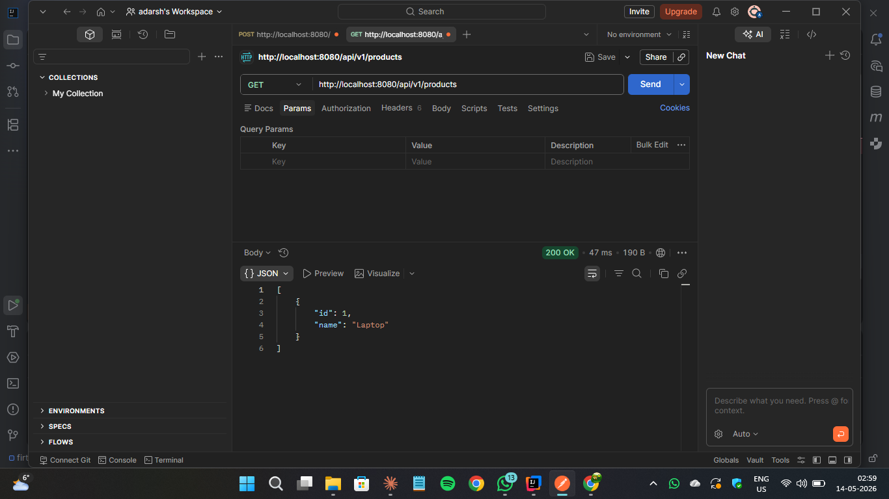
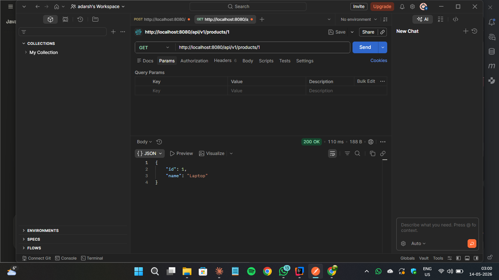
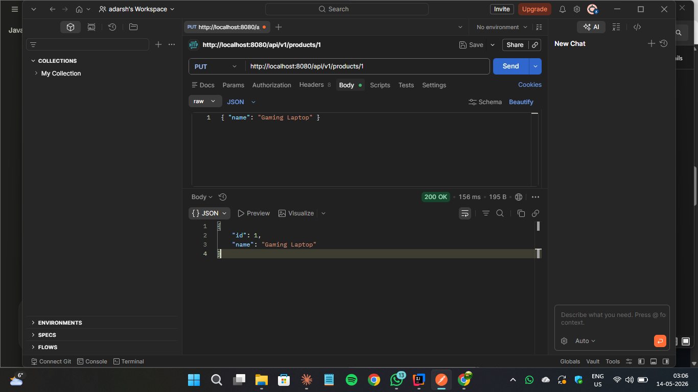
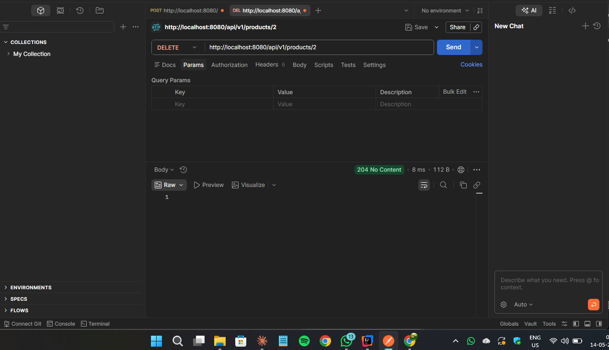
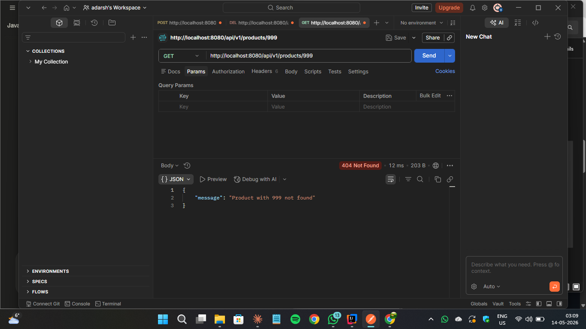
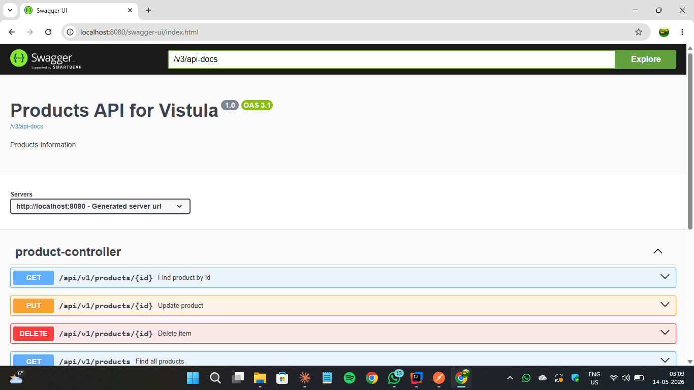
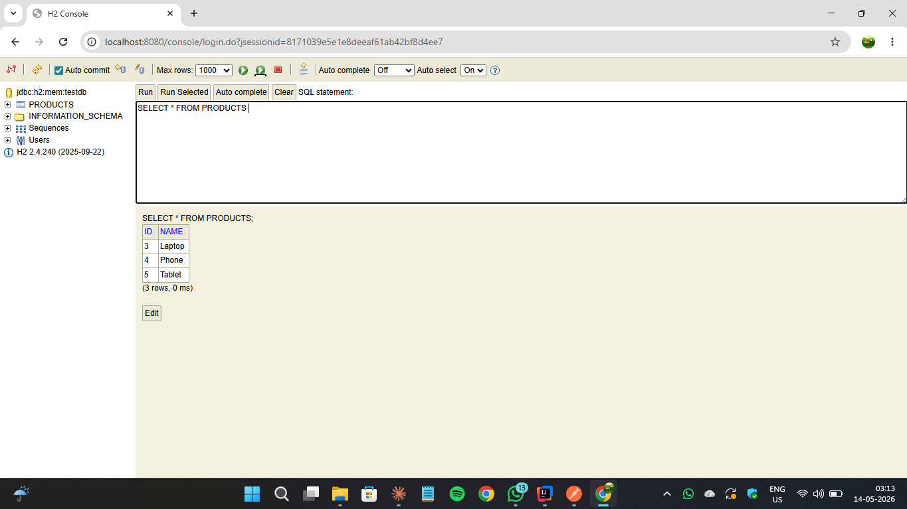

# 📦 Spring Boot Task 2 – REST API Application

This project is a Spring Boot REST API created as part of Task 2
for the Spring Framework / Java course.

The purpose of the project is to understand REST API development,
layered architecture, database integration, and proper exception handling.

---

## 📌 Project Overview

The application demonstrates:

- How to create a REST API using Spring Boot
- How to perform CRUD operations using Spring Data JPA
- How to connect to an H2 in-memory database
- How to handle exceptions globally using `@ControllerAdvice`
- How to document and test the API using Swagger UI and Postman

---

## ✅ Application Features

- Full CRUD operations for managing products
- Layered architecture (Controller → Service → Repository → Database)
- H2 in-memory database with web console access
- Custom exception handling with proper HTTP status codes
- API documentation via Swagger UI
- Runs locally on port `8080`

---

## 🌐 Available Endpoints

Base URL: `http://localhost:8080/api/v1/products`

### ✅ Create Product
- **Method:** POST
- **URL:** `/api/v1/products`
- **Body:** `{ "name": "Laptop" }`
- **Response:** 201 Created

### ✅ Get All Products
- **Method:** GET
- **URL:** `/api/v1/products`
- **Response:** 200 OK

### ✅ Get Product by ID
- **Method:** GET
- **URL:** `/api/v1/products/{id}`
- **Response:** 200 OK

### ✅ Update Product
- **Method:** PUT
- **URL:** `/api/v1/products/{id}`
- **Body:** `{ "name": "Gaming Laptop" }`
- **Response:** 200 OK

### ✅ Delete Product
- **Method:** DELETE
- **URL:** `/api/v1/products/{id}`
- **Response:** 204 No Content

---

## ❗ Exception Handling

If a product ID does not exist the API returns:

- **HTTP Status:** 404 Not Found
- **Body:** `{ "message": "Product with id 999 not found" }`

---

## 🗄 Database

H2 in-memory database console:
- **URL:** `http://localhost:8080/console`
- **JDBC URL:** `jdbc:h2:mem:testdb`
- **Username:** `sa`
- **Password:** *(empty)*

---

## 🧪 API Testing

Tested using **Postman** and **Swagger UI**.

**Swagger UI:** `http://localhost:8080/swagger-ui/index.html`

Test flow:
1. POST – create a product
2. GET all – retrieve all products
3. GET by ID – retrieve specific product
4. PUT – update a product
5. DELETE – remove a product
6. GET invalid ID – verify 404 error

---

## ▶ How to Run

1. Clone the repository
2. Open in IntelliJ IDEA
3. Run `FirstRestApiSpringApplication`
4. Access API at `http://localhost:8080`
5. Test using Postman or Swagger UI

---

## ✅ Screenshots

